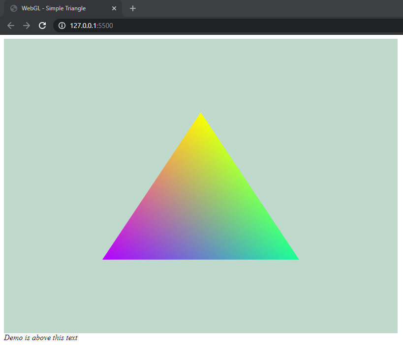

# WebGL
Practice using WebGL to do basic operations.

### Basic Shader

Learning to understand basic functionalities within WebGL by following this [tutorial](https://www.youtube.com/watch?v=kB0ZVUrI4Aw).

  

